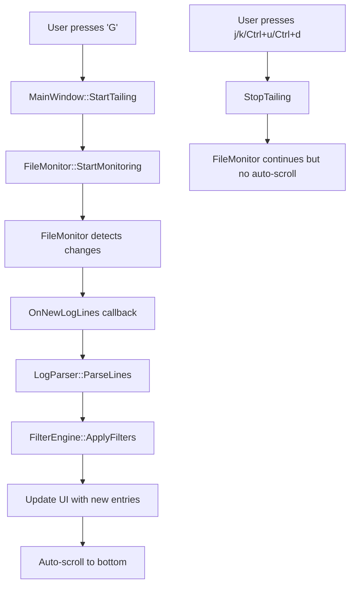

# Design Document

## Overview

The enhanced log tailing feature transforms the existing 'G' command from a simple "go to end" operation into an intelligent real-time monitoring system. The design integrates the existing FileMonitor infrastructure with the MainWindow UI to provide seamless log tailing that respects user navigation preferences and maintains compatibility with all existing features.

## Architecture

### Core Components

1. **MainWindow** - Enhanced with tailing state management and auto-scroll logic
2. **FileMonitor** - Existing component that provides real-time file change detection
3. **LogParser** - Existing component that parses new log lines
4. **FilterEngine** - Existing component that applies filters to new entries
5. **TailingState** - New state management for tailing behavior

### Component Interactions



## Components and Interfaces

### Enhanced MainWindow Interface

```cpp
class MainWindow {
private:
    bool is_tailing_ = false;
    bool auto_scroll_enabled_ = false;
    
public:
    // Enhanced tailing methods
    bool StartTailing();
    void StopTailing();
    bool IsTailing() const { return is_tailing_; }
    
    // Navigation override methods
    void SelectNextEntry() override;  // Enhanced to stop tailing
    void SelectPreviousEntry() override;  // Enhanced to stop tailing
    void ScrollPageUp() override;  // Enhanced to stop tailing
    void ScrollPageDown() override;  // Enhanced to stop tailing
    
    // Callback for new log lines
    void OnNewLogLines(const std::vector<std::string>& new_lines);
    
private:
    void SetupFileMonitorCallback();
    void ProcessNewLogLines(const std::vector<LogEntry>& new_entries);
    void AutoScrollToBottom();
    bool ShouldStopTailing(const Event& event);
};
```

### FileMonitor Integration

The existing FileMonitor will be configured with a callback that points to `MainWindow::OnNewLogLines`. No changes needed to FileMonitor itself.

### Event Handling Enhancement

Current event handling will be enhanced to detect tailing-cancelling events:

```cpp
bool MainWindowComponent::OnEvent(Event event) override {
    // Check if this event should stop tailing
    if (parent_->IsTailing() && parent_->ShouldStopTailing(event)) {
        parent_->StopTailing();
    }
    
    // Continue with existing event handling...
}
```

## Data Models

### TailingState Structure

```cpp
struct TailingState {
    bool is_active = false;
    bool auto_scroll_enabled = false;
    size_t last_processed_entry_count = 0;
    std::chrono::steady_clock::time_point last_update_time;
};
```

### LogEntry Processing Flow

1. **New lines detected** by FileMonitor
2. **Parse lines** using existing LogParser
3. **Apply filters** using existing FilterEngine  
4. **Add to log_entries_** vector
5. **Update filtered_entries_** if filters active
6. **Auto-scroll** if tailing is active
7. **Update UI** with new content

## Error Handling

### File Monitor Errors

- **File becomes unavailable**: Show error message but keep tailing active
- **File rotation detected**: Continue tailing with new file
- **Parse errors**: Log error but continue processing other lines
- **Memory pressure**: Implement entry limit with circular buffer behavior

### UI Error States

- **No file loaded**: Show "No file loaded" message when 'G' pressed
- **File monitor start failure**: Show error and fall back to static mode
- **Large log bursts**: Implement batching to prevent UI blocking

## Testing Strategy

### Unit Tests

1. **TailingState Management**
   - Test StartTailing/StopTailing state transitions
   - Test event-based tailing cancellation
   - Test tailing with no file loaded

2. **FileMonitor Integration**
   - Test callback setup and teardown
   - Test new line processing
   - Test error handling scenarios

3. **Filter Integration**
   - Test tailing with active filters
   - Test filter changes during tailing
   - Test search functionality during tailing

### Integration Tests

1. **End-to-End Tailing**
   - Load file, start tailing, append new lines, verify auto-scroll
   - Test tailing cancellation via navigation keys
   - Test tailing with various file operations

2. **Performance Tests**
   - Test with high-frequency log updates
   - Test memory usage during long tailing sessions
   - Test UI responsiveness during log bursts

### Manual Testing Scenarios

1. **Basic Tailing Flow**
   - Load log file
   - Press 'G' to start tailing
   - Append lines to file externally
   - Verify auto-scroll and "LIVE" indicator

2. **Navigation Cancellation**
   - Start tailing
   - Press j/k/Ctrl+u/Ctrl+d
   - Verify tailing stops and position maintained

3. **Filter Compatibility**
   - Start tailing with filters active
   - Add new lines that match/don't match filters
   - Verify correct filtering of new entries

## Implementation Phases

### Phase 1: Core Tailing Infrastructure
- Implement tailing state management
- Enhance 'G' key handler
- Implement OnNewLogLines callback
- Add navigation event detection

### Phase 2: FileMonitor Integration
- Set up FileMonitor callback in StartTailing
- Implement real-time log parsing
- Add auto-scroll logic
- Update UI status indicators

### Phase 3: Filter and Search Integration
- Ensure new entries go through filter pipeline
- Test search functionality with new entries
- Verify filter changes work during tailing

### Phase 4: Error Handling and Polish
- Implement robust error handling
- Add performance optimizations
- Implement memory management for long sessions
- Add comprehensive testing

## Performance Considerations

### Memory Management
- Implement maximum entry limit (configurable, default 10,000 entries)
- Use circular buffer for very long tailing sessions
- Clean up filtered entries when base entries are pruned

### UI Responsiveness
- Batch process multiple new lines in single UI update
- Limit auto-scroll frequency to prevent excessive redraws
- Use background thread for log parsing if needed

### File I/O Optimization
- Leverage existing FileMonitor efficient polling
- Minimize file system calls
- Handle file rotation gracefully without interruption