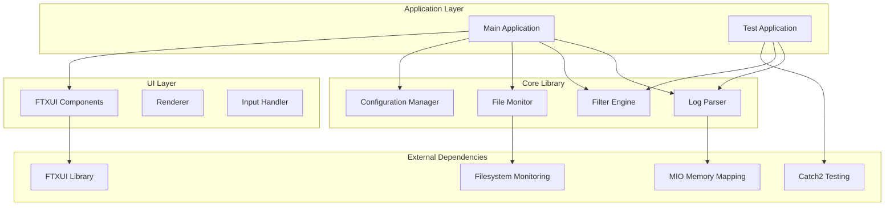

# Design Document

## Overview

The Unreal Engine Log Viewer is designed as a modular C++ application using FTXUI for terminal-based UI, structured around a library-application architecture. The system employs memory-mapped file I/O for performance, real-time file monitoring for live log tailing, and a sophisticated multi-level filtering system with visual highlighting.

The architecture separates concerns into distinct layers: a core logging library for data processing and filtering, a UI layer for presentation and interaction, and a configuration system for persistence. This design enables efficient processing of large log files while maintaining responsive user interaction.

## Architecture

### High-Level Architecture



### Project Structure

```
unreal-log-viewer/
├── lib/
│   ├── log_parser/
│   │   ├── log_entry.h
│   │   ├── log_parser.h
│   │   └── log_parser.cpp
│   ├── filter_engine/
│   │   ├── filter.h
│   │   ├── filter_engine.h
│   │   └── filter_engine.cpp
│   ├── file_monitor/
│   │   ├── file_monitor.h
│   │   └── file_monitor.cpp
│   └── config/
│       ├── config_manager.h
│       └── config_manager.cpp
├── app/
│   ├── ui/
│   │   ├── main_window.h
│   │   ├── main_window.cpp
│   │   ├── filter_panel.h
│   │   └── filter_panel.cpp
│   └── main.cpp
├── tests/
│   ├── test_log_parser.cpp
│   ├── test_filter_engine.cpp
│   └── test_main.cpp
├── macros.h
└── CMakeLists.txt
```

## Components and Interfaces

### Core Library Components

#### LogEntry Data Model

```cpp
namespace ue_log {
    enum class LogEntryType {
        Structured,      // [timestamp][frame]Logger: Level: message
        SemiStructured,  // [timestamp][frame]Logger: message (no level)
        Unstructured     // Logger: Level: message (no timestamp/frame)
    };
    
    class LogEntry {
        CK_GENERATED_BODY(LogEntry);
        
    private:
        LogEntryType entry_type;
        std::optional<std::string> timestamp;
        std::optional<int> frame_number;
        std::string logger_name;
        std::optional<std::string> log_level;
        std::string message;
        std::string raw_line;
        size_t line_number;
        
    public:
        CK_DEFINE_CONSTRUCTORS(LogEntry, logger_name, message, raw_line);
        CK_PROPERTY(entry_type);
        CK_PROPERTY(timestamp);
        CK_PROPERTY(frame_number);
        CK_PROPERTY(logger_name);
        CK_PROPERTY(log_level);
        CK_PROPERTY(message);
        CK_PROPERTY(raw_line);
        CK_PROPERTY(line_number);
        
        bool IsValid() const;
        bool IsStructured() const { return entry_type == LogEntryType::Structured; }
        bool HasTimestamp() const { return timestamp.has_value(); }
        bool HasFrameNumber() const { return frame_number.has_value(); }
        bool HasLogLevel() const { return log_level.has_value(); }
        std::string GetDisplayTimestamp() const;
        std::string GetDisplayLogLevel() const;
        std::string ToString() const;
    };
}
```

#### LogParser Interface

```cpp
namespace ue_log {
    class LogParser {
        CK_GENERATED_BODY(LogParser);
        
    private:
        mio::mmap_source memory_map;
        std::vector<LogEntry> parsed_entries;
        std::regex structured_pattern;        // [timestamp][frame]Logger: Level: message
        std::regex semi_structured_pattern;   // [timestamp][frame]Logger: message
        std::regex unstructured_pattern;      // Logger: Level: message
        size_t current_line_number;
        
    public:
        CK_DEFINE_CONSTRUCTORS(LogParser);
        
        bool LoadFile(const std::string& file_path);
        std::vector<LogEntry> ParseEntries(size_t start_offset = 0);
        LogEntry ParseSingleEntry(const std::string& line, size_t line_number);
        LogEntryType DetectEntryType(const std::string& line);
        bool IsStructuredFormat(const std::string& line);
        bool IsSemiStructuredFormat(const std::string& line);
        bool IsUnstructuredFormat(const std::string& line);
        
        CK_PROPERTY_GET(parsed_entries);
        
    private:
        LogEntry ParseStructuredEntry(const std::string& line, size_t line_number);
        LogEntry ParseSemiStructuredEntry(const std::string& line, size_t line_number);
        LogEntry ParseUnstructuredEntry(const std::string& line, size_t line_number);
        std::string ExtractTimestamp(const std::string& line);
        std::optional<int> ExtractFrameNumber(const std::string& line);
        std::string ExtractLoggerName(const std::string& line, LogEntryType type);
        std::optional<std::string> ExtractLogLevel(const std::string& line, LogEntryType type);
        std::string ExtractMessage(const std::string& line, LogEntryType type);
    };
}
```

#### Filter System

```cpp
namespace ue_log {
    enum class FilterType {
        TextContains,
        TextExact,
        TextRegex,
        LoggerName,
        LogLevel,
        TimeRange,
        FrameRange
    };
    
    enum class FilterLogic {
        And,
        Or
    };
    
    class Filter {
        CK_GENERATED_BODY(Filter);
        
    private:
        std::string name;
        FilterType type;
        std::string criteria;
        bool is_active;
        std::vector<std::unique_ptr<Filter>> sub_filters;
        FilterLogic logic;
        std::string highlight_color;
        
    public:
        CK_DEFINE_CONSTRUCTORS(Filter, name, type, criteria);
        CK_PROPERTY(name);
        CK_PROPERTY(type);
        CK_PROPERTY(criteria);
        CK_PROPERTY(is_active);
        CK_PROPERTY(logic);
        CK_PROPERTY(highlight_color);
        
        bool Matches(const LogEntry& entry) const;
        void AddSubFilter(std::unique_ptr<Filter> sub_filter);
        const std::vector<std::unique_ptr<Filter>>& GetSubFilters() const;
        size_t GetMatchCount() const;
    };
    
    class FilterEngine {
        CK_GENERATED_BODY(FilterEngine);
        
    private:
        std::vector<std::unique_ptr<Filter>> primary_filters;
        std::unordered_map<std::string, std::regex> compiled_regex_cache;
        
    public:
        CK_DEFINE_CONSTRUCTORS(FilterEngine);
        
        void AddFilter(std::unique_ptr<Filter> filter);
        void RemoveFilter(const std::string& filter_name);
        std::vector<LogEntry> ApplyFilters(const std::vector<LogEntry>& entries);
        Filter* FindFilter(const std::string& name);
        
        CK_PROPERTY_GET(primary_filters);
    };
}
```

#### File Monitor

```cpp
namespace ue_log {
    class FileMonitor {
        CK_GENERATED_BODY(FileMonitor);
        
    private:
        std::string monitored_file_path;
        std::atomic<bool> is_monitoring;
        std::thread monitor_thread;
        std::function<void(const std::vector<std::string>&)> new_lines_callback;
        size_t last_file_size;
        
    public:
        CK_DEFINE_CONSTRUCTORS(FileMonitor);
        ~FileMonitor();
        
        bool StartMonitoring(const std::string& file_path);
        void StopMonitoring();
        void SetNewLinesCallback(std::function<void(const std::vector<std::string>&)> callback);
        bool IsMonitoring() const;
        
    private:
        void MonitorLoop();
        std::vector<std::string> ReadNewLines();
    };
}
```

### UI Components

#### Main Window

```cpp
namespace ue_log {
    class MainWindow {
        CK_GENERATED_BODY(MainWindow);
        
    private:
        std::unique_ptr<LogParser> log_parser;
        std::unique_ptr<FilterEngine> filter_engine;
        std::unique_ptr<FileMonitor> file_monitor;
        std::unique_ptr<FilterPanel> filter_panel;
        
        std::vector<LogEntry> displayed_entries;
        int selected_entry_index;
        bool is_tailing_mode;
        bool show_filter_panel;
        
        // FTXUI Components
        ftxui::Component main_container;
        ftxui::Component log_table;
        ftxui::Component status_bar;
        
    public:
        CK_DEFINE_CONSTRUCTORS(MainWindow);
        
        void Initialize();
        bool LoadLogFile(const std::string& file_path);
        void StartTailing();
        void StopTailing();
        void ToggleFilterPanel();
        void RefreshDisplay();
        
        ftxui::Component GetComponent();
        ftxui::Element Render();
        
    private:
        void SetupKeyBindings();
        void OnNewLogLines(const std::vector<std::string>& new_lines);
        ftxui::Element RenderLogTable();
        ftxui::Element RenderStatusBar();
        std::string GetHighlightColor(const LogEntry& entry);
    };
}
```

#### Filter Panel

```cpp
namespace ue_log {
    class FilterPanel {
        CK_GENERATED_BODY(FilterPanel);
        
    private:
        FilterEngine* filter_engine;
        int selected_filter_index;
        bool is_editing_filter;
        std::string edit_buffer;
        
        // FTXUI Components
        ftxui::Component filter_tree;
        ftxui::Component filter_controls;
        
    public:
        CK_DEFINE_CONSTRUCTORS(FilterPanel, filter_engine);
        
        ftxui::Component GetComponent();
        ftxui::Element Render();
        
        void AddNewFilter();
        void EditSelectedFilter();
        void DeleteSelectedFilter();
        void ToggleSelectedFilter();
        
    private:
        ftxui::Element RenderFilterTree();
        ftxui::Element RenderFilterControls();
        void SetupFilterKeyBindings();
    };
}
```

## Data Models

### Configuration Data

```cpp
namespace ue_log {
    struct ColorScheme {
        std::string primary_filter_colors[10];
        std::string background_color;
        std::string text_color;
        std::string highlight_color;
    };
    
    struct KeyBindings {
        std::string toggle_filter_panel = "Tab";
        std::string toggle_tailing = "F5";
        std::string quick_search = "Ctrl+F";
        std::string jump_to_line = "Ctrl+G";
        std::string add_filter = "Ctrl+N";
        std::string edit_filter = "F2";
        std::string delete_filter = "Delete";
    };
    
    struct AppConfig {
        CK_GENERATED_BODY(AppConfig);
        
    private:
        ColorScheme color_scheme;
        KeyBindings key_bindings;
        std::vector<Filter> saved_filters;
        std::string last_opened_file;
        bool auto_tail_new_files;
        int max_displayed_entries;
        
    public:
        CK_DEFINE_CONSTRUCTORS(AppConfig);
        CK_PROPERTY(color_scheme);
        CK_PROPERTY(key_bindings);
        CK_PROPERTY(saved_filters);
        CK_PROPERTY(last_opened_file);
        CK_PROPERTY(auto_tail_new_files);
        CK_PROPERTY(max_displayed_entries);
        
        bool LoadFromFile(const std::string& config_path);
        bool SaveToFile(const std::string& config_path);
    };
}
```

## Error Handling

### Error Categories

1. **File I/O Errors**: File not found, permission denied, file locked
2. **Parsing Errors**: Malformed log entries, unsupported formats
3. **Filter Errors**: Invalid regex patterns, malformed filter criteria
4. **Memory Errors**: Out of memory, memory mapping failures
5. **Configuration Errors**: Invalid config files, missing settings

### Error Handling Strategy

```cpp
namespace ue_log {
    enum class ErrorCode {
        Success,
        FileNotFound,
        FileAccessDenied,
        FileLocked,
        InvalidLogFormat,
        InvalidRegexPattern,
        OutOfMemory,
        ConfigurationError,
        UnknownError
    };
    
    class Result {
        CK_GENERATED_BODY(Result);
        
    private:
        ErrorCode error_code;
        std::string error_message;
        bool is_success;
        
    public:
        CK_DEFINE_CONSTRUCTORS(Result, error_code, error_message);
        
        static Result Success();
        static Result Error(ErrorCode code, const std::string& message);
        
        CK_PROPERTY_GET(error_code);
        CK_PROPERTY_GET(error_message);
        CK_PROPERTY_GET(is_success);
        
        bool IsSuccess() const { return is_success; }
        bool IsError() const { return !is_success; }
    };
}
```

## Testing Strategy

### Unit Testing Approach

1. **Log Parser Tests**: Test parsing of various UE4/UE5 log formats, malformed entries, edge cases
2. **Filter Engine Tests**: Test all filter types, nested filters, logical operations, performance
3. **File Monitor Tests**: Test file watching, new line detection, file rotation handling
4. **Configuration Tests**: Test config loading/saving, validation, default values
5. **Integration Tests**: Test complete workflows, UI interactions, real-time scenarios

### Test Structure

```cpp
// Example test structure using Catch2
namespace ue_log::tests {
    TEST_CASE("LogParser can parse UE4 format", "[log_parser]") {
        LogParser parser;
        std::string ue4_line = "[2024.01.15-10.30.45:123][456]LogTemp: Warning: Test message";
        
        LogEntry entry = parser.ParseSingleEntry(ue4_line);
        
        REQUIRE(entry.Get_timestamp() == "2024.01.15-10.30.45:123");
        REQUIRE(entry.Get_frame_number() == 456);
        REQUIRE(entry.Get_logger_name() == "LogTemp");
        REQUIRE(entry.Get_log_level() == "Warning");
        REQUIRE(entry.Get_message() == "Test message");
    }
    
    TEST_CASE("FilterEngine applies nested filters correctly", "[filter_engine]") {
        FilterEngine engine;
        auto primary_filter = std::make_unique<Filter>("Errors", FilterType::LogLevel, "Error");
        auto sub_filter = std::make_unique<Filter>("LogTemp", FilterType::LoggerName, "LogTemp");
        
        primary_filter->AddSubFilter(std::move(sub_filter));
        engine.AddFilter(std::move(primary_filter));
        
        std::vector<LogEntry> test_entries = CreateTestEntries();
        auto filtered = engine.ApplyFilters(test_entries);
        
        REQUIRE(filtered.size() > 0);
        for (const auto& entry : filtered) {
            REQUIRE(entry.Get_log_level() == "Error");
            REQUIRE(entry.Get_logger_name() == "LogTemp");
        }
    }
}
```

### Performance Testing

1. **Large File Handling**: Test with 1GB+ log files
2. **Real-time Performance**: Measure latency for new log entry processing
3. **Memory Usage**: Monitor memory consumption during extended sessions
4. **Filter Performance**: Benchmark complex nested filter operations
5. **UI Responsiveness**: Ensure UI remains responsive during heavy processing

## Implementation Notes

### Memory Management

- Use RAII principles throughout the codebase
- Employ smart pointers for dynamic allocations
- Implement memory-mapped I/O for large file handling
- Use move semantics where appropriate to minimize copying

### Threading Model

- Main UI thread for FTXUI rendering and user interaction
- Background thread for file monitoring
- Thread-safe communication using atomic variables and mutexes
- Avoid blocking the UI thread with I/O operations

### Performance Optimizations

- Memory-mapped file I/O using MIO library for fast file access
- Lazy loading of log entries to reduce startup time
- Virtual scrolling for large datasets
- Regex compilation caching to avoid repeated compilation
- Efficient string handling with move semantics

### Platform Considerations

- Use std::filesystem for cross-platform file operations
- Platform-specific file monitoring (inotify on Linux, ReadDirectoryChangesW on Windows)
- Terminal capability detection for color support
- Proper handling of different line ending formats (CRLF vs LF)